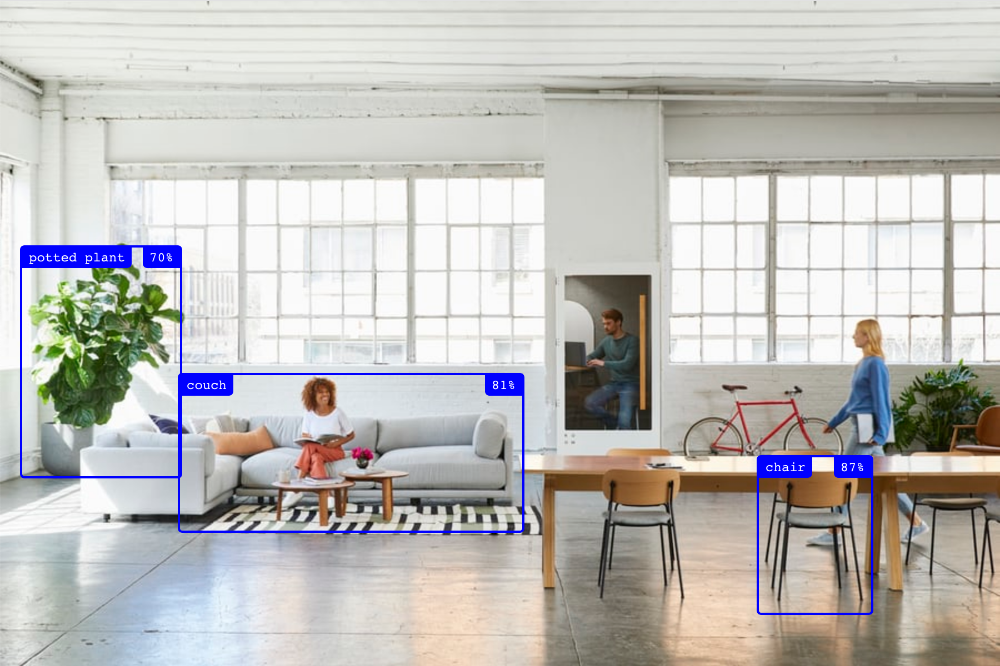

# use-tensorflow

A React hook for tensorflow.js to detect objects and poses easily:



```js
import React, { useRef } from "react";
import { useObjects } from "use-tensorflow";    // This library :)
import { Container, Box } from './components';  // Find the implementation below

export default () => {
  const ref = useRef(null);
  const objects = useObjects(ref);
  return (
    <Container>
      
      {objects.map(({ left, top, width, height, label, score }) => (
        <Box
          left={left}
          top={top}
          width={width}
          height={height}
          label={label}
          color={score > 0.6 ? "blue" : "red"}
          score={score}
        />
      ))}
    </Container>
  );
};
```

The first argument is the image or video reference, and the second argument is the options for [tensorflow.js](https://www.tensorflow.org/js). [Loading local models](#loading-local-models):

```js
const objects = useObjects(ref, { modelUrl: "/objects/model.json" });
```

## Realtime computer camera recognition

To load a realtime video you can install `use-camera` and do:

```js
import React from "react";
import useObjects from "./useObjects";
import useCamera from "use-camera";
import { Container, Box } from './components';

export default () => {
  const ref = useCamera({ audio: false });
  const objects = useObjects(ref, { modelUrl: "/objects/model.json" });
  return (
    <Container>
      <video ref={ref} autoPlay width="640" height="480" />
      {objects.map(({ left, top, width, height, label, score }) => (
        <Box
          left={left}
          top={top}
          width={width}
          height={height}
          label={label}
          color={score > 0.6 ? "blue" : "red"}
          score={score}
        />
      ))}
    </Container>
  );
};
```

> Note: unfortunately this does *not* work well in Codesandbox, so no demo there

## Loading local models

For local development you very likely want to download the model that you are using and load it locally. I haven't found an easy way of doing this, so let's get scrappy:

`1.` Open the network requests in the browser and load the library without the `modelUrl`:

```js
useObjects(ref);
```

`2.` Copy the `.json` file and all the related files into your `public` folder. Create a folder called `public/objects` and put it all there:


## Example: bounding boxes

An example with all the bounding boxes and the border color depending on the accuracy. We're using [Styled Components](https://www.styled-components.com/) here, but use any styling library you prefer:

```js
import styled from 'styled-components';

export const Container = styled.div`
  position: relative;
`;

export const Box = styled.div`
  border: 2px solid ${({ color }) => color || "red"};
  position: absolute;
  border-radius: 6px;
  left: ${({ left }) => left}px;
  top: ${({ top }) => top}px;
  width: ${({ width }) => width}px;
  height: ${({ height }) => height}px;

  &::before,
  &::after {
    display: block;
    position: absolute;
    top: 0;
    color: white;
    background: ${({ color }) => color || "red"};
    padding: 3px 6px;
    font-size: 12px;
    font-family: monospace;
  }

  &::before {
    content: "${({ label }) => label}";
    left: 0;
    border-radius: 0 0 6px;
  }

  &::after {
    content: "${({ score }) => Math.round(score * 100)}%";
    right: 0;
    border-radius: 0 0 0 6px;
  }
`;
```


## Credits

Unsplash picture by [ROOM](https://room.com/):

https://unsplash.com/photos/FZrn8fhqpp8
