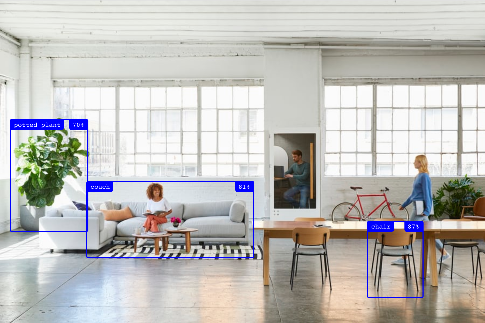
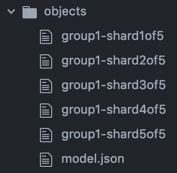

# use-tensorflow

A React hook for tensorflow.js to detect objects and poses easily:



```js
import React, { useRef } from "react";
import { useObjects } from "use-tensorflow";    // This library :)
import { Container, Box } from './components';  // Find the implementation below

export default () => {
  const ref = useRef(null);
  const objects = useObjects(ref);
  return (
    <Container>
      
      {objects ? objects.map(({ left, top, width, height, label, score }) => (
        <Box
          left={left}
          top={top}
          width={width}
          height={height}
          label={label}
          color={score > 0.6 ? "blue" : "red"}
          score={score}
        />
      )) : 'Loading...'}
    </Container>
  );
};
```


## API

Import one of the models:

```js
// Available models right now
import { usePoses, useObjects } from 'use-tensorflow';
```

All the named imported models follow the same structure:

```js
export default () => {
  const ref = useRef();
  const detected = use{Name}(ref, config);
  return ...;
};
```

- `ref`: the reference for the image or video.
- `config`: the configuration for the specific model in Tensorflow. See [Coco SSD example](https://github.com/tensorflow/tfjs-models/tree/master/coco-ssd#api).
  - `modelUrl`: where to load the model from. [You can load them locally](#loading-local-models) for better performance in dev.

There's also a default export `useTensorflow`, but it's experimental by now.


## useObjects

Detect objects in the image, including the label, position and score:

```js
import React, { useRef } from 'react';
import { useObjects } from 'use-tensorflow';

export default () => {
  const ref = useRef();
  const objects = useObjects(ref, { modelUrl: "/objects/model.json" });
  console.log(objects);
  return ;
};
```

Output:

```js
[
  {
    "label": "chair",
    "score": 0.8703018426895142,
    "left": 681,
    "top": 409,
    "width": 101,
    "height": 140
  },
  {
    "label": "couch",
    "score": 0.8127394318580627,
    "left": 160,
    "top": 335,
    "width": 308,
    "height": 140
  },
  ...
]
```

## usePoses

Using poses as well:

```js
import React, { useRef } from 'react';
import { usePoses } from 'use-tensorflow';

export default () => {
  const ref = useRef();
  const poses = usePoses(ref);
  console.log(poses);
  return ;
};
```

```js
[
  {
    "nose": {
      "label": "nose",
      "left": 762,
      "top": 299,
      "score": 0.22580526769161224
    },
    "leftEye": {
      "label": "leftEye",
      "left": 758,
      "top": 294,
      "score": 0.24668794870376587
    },
    ...
  },
  ...
]
```

All the keys are:

- `nose`
- `leftEye`
- `rightEye`
- `leftEar`
- `rightEar`
- `leftShoulder`
- `rightShoulder`
- `leftElbow`
- `rightElbow`
- `leftWrist`
- `rightWrist`
- `leftHip`
- `rightHip`
- `leftKnee`
- `rightKnee`
- `leftAnkle`
- `rightAnkle`


### useTensorflow

This is too experimental right now, please read the code to see how it works for now under `src/useModel.js`.


## Examples

Some more examples. These examples unfortunately don't load on Codesandbox, so you'll have to install and load them locally for them to work (including loading the images locally to avoid CORS issues).


### Loading local models

For local development you very likely want to download and load the model locally for speed. I haven't found an easy way of doing this, so let's get scrappy:

`1.` Open the network requests in the browser and load the library without the `modelUrl`:

```js
useObjects(ref);
```

`2.` Copy the `.json` file and all the related files into your `public` folder. Create a folder called `public/objects` and put it all there:



`3.` Point the `use{Name}` to these files from the public location:

```js
const objects = useObjects(ref, { modelUrl: "/objects/model.json" });
const poses = usePoses(ref, { modelUrl: "/poses/model.json" });
```


## Realtime camera recognition

To load a realtime video you can install [my library `use-camera`](https://github.com/franciscop/use-camera) and do:

```js
import React from "react";
import useCamera from "use-camera";
import { useObjects } from "use-tensorflow";
import { Container, Box } from "./components";

export default () => {
  const ref = useCamera({ audio: false });
  const objects = useObjects(ref, { modelUrl: "/objects/model.json" });
  return (
    <Container>
      <video ref={ref} autoPlay width="640" height="480" />
      {objects && objects.map(({ left, top, width, height, label, score }) => (
        <Box
          left={left}
          top={top}
          width={width}
          height={height}
          label={label}
          color={score > 0.6 ? "blue" : "red"}
          score={score}
        />
      ))}
    </Container>
  );
};
```


## Adding bounding boxes

An example with all the bounding boxes and the border color depending on the accuracy. We're using [Styled Components](https://www.styled-components.com/) here, but use any styling library you prefer:

```js
import styled from "styled-components";

// See their implementations below
export const Container = styled.div`
  position: relative;
`;

export const Box = styled.div.attrs(props => ({
  style: {
    left: `${props.left}px`,
    top: `${props.top}px`,
    width: `${props.width}px`,
    height: `${props.height}px`
  }
}))`
  border: 2px solid ${({ color }) => color || "red"};
  position: absolute;
  border-radius: 4px;

  &::before,
  &::after {
    display: block;
    position: absolute;
    top: 0;
    color: white;
    background: ${({ color }) => color || "red"};
    padding: 3px 6px;
    font-size: 12px;
    font-family: monospace;
  }

  &::before {
    content: "${({ label }) => label}";
    left: 0;
    border-radius: 0 0 4px;
  }

  &::after {
    content: "${({ score }) => Math.round(score * 100)}%";
    right: 0;
    border-radius: 0 0 0 4px;
  }
`;

export const Circle = styled.div`
  content: "";
  background: ${({ color }) => color || "red"};
  position: absolute;
  width: 8px;
  height: 8px;
  transform: translate(-4px, -4px);
  border-radius: 8px;
  left: ${({ left }) => left}px;
  top: ${({ top }) => top}px;
  width: ${({ width }) => width}px;
  height: ${({ height }) => height}px;
`;
```


## Credits

Unsplash picture by [ROOM](https://room.com/):

https://unsplash.com/photos/FZrn8fhqpp8
